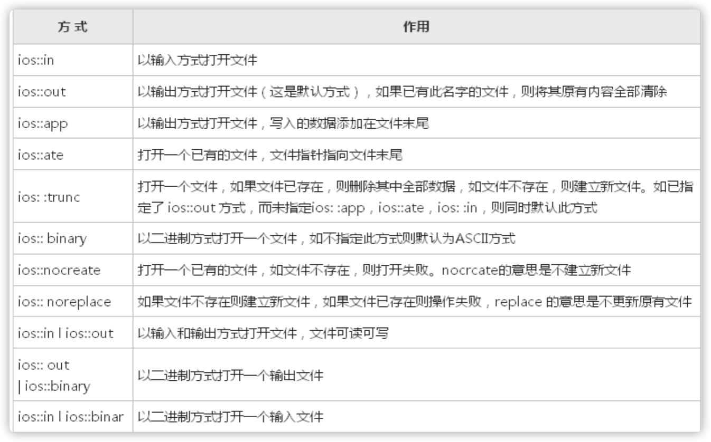

<!-- TOC -->

- [1. 介绍](#1-介绍)
- [2. 模板Template](#2-模板template)
    - [2.1. 函数模板](#21-函数模板)
        - [2.1.1. 语法](#211-语法)
        - [2.1.2. 普通函数与模板函数的调用](#212-普通函数与模板函数的调用)
        - [2.1.3. 函数模板的调用规则](#213-函数模板的调用规则)
        - [2.1.4. 函数模板机制](#214-函数模板机制)
    - [2.2. 类模板](#22-类模板)
        - [2.2.1. 语法](#221-语法)
        - [2.2.2. 模板类派生为普通类](#222-模板类派生为普通类)
        - [2.2.3. 模板类派生模板类](#223-模板类派生模板类)
        - [2.2.4. 所有的类模板函数写在类的外部，在一个cpp中](#224-所有的类模板函数写在类的外部在一个cpp中)
        - [2.2.5. 类模板声明与实现分开在两个文件里](#225-类模板声明与实现分开在两个文件里)
        - [2.2.6. 类模板中的static关键字](#226-类模板中的static关键字)
        - [2.2.7. 应用中需要注意的地方](#227-应用中需要注意的地方)
- [3. 类型转换](#3-类型转换)
    - [3.1. 语法](#31-语法)
        - [3.1.1. C风格类型转换](#311-c风格类型转换)
        - [3.1.2. C++风格类型转换](#312-c风格类型转换)
        - [3.1.3. 一般性介绍](#313-一般性介绍)
- [4. 异常Exception](#4-异常exception)
    - [4.1. 传统错误处理机制](#41-传统错误处理机制)
    - [4.2. 异常处理的基本思想](#42-异常处理的基本思想)
    - [4.3. 语法](#43-语法)
        - [4.3.1. 抛掷异常](#431-抛掷异常)
        - [4.3.2. 捕获异常并处理异常的程序段](#432-捕获异常并处理异常的程序段)
        - [4.3.3. 异常接口声明](#433-异常接口声明)
        - [4.3.4. 抛出对象对象的异常](#434-抛出对象对象的异常)
        - [4.3.5. 标准程序异常](#435-标准程序异常)
- [5. I/O](#5-io)
    - [5.1. 常用的IO类](#51-常用的io类)
    - [5.2. 与iostream类库有关的头文件](#52-与iostream类库有关的头文件)
    - [5.3. 标准IO流](#53-标准io流)
        - [5.3.1. 标准输入流对象cin常用的函数](#531-标准输入流对象cin常用的函数)
        - [5.3.2. 标准输出流对象cout常用的函数](#532-标准输出流对象cout常用的函数)
        - [5.3.3. c++ 格式化输出](#533-c-格式化输出)
    - [5.4. 文件IO](#54-文件io)
        - [5.4.1. 打开文件](#541-打开文件)
            - [5.4.1.1. 调用文件流的成员函数open](#5411-调用文件流的成员函数open)
            - [5.4.1.2. 文件输入输出方式的设置](#5412-文件输入输出方式的设置)
        - [5.4.2. 关闭文件](#542-关闭文件)
        - [5.4.3. ASCII文件读写](#543-ascii文件读写)
        - [5.4.4. 对二进制文件的读写操作](#544-对二进制文件的读写操作)
- [6. STL(标准模板库)理论基础](#6-stl标准模板库理论基础)
    - [6.1. 基本概念](#61-基本概念)
        - [6.1.1. STL详细的说有六大组件](#611-stl详细的说有六大组件)
        - [6.1.2. 容器](#612-容器)
            - [6.1.2.1. 容器的分类](#6121-容器的分类)
        - [6.1.3. 迭代器](#613-迭代器)
        - [6.1.4. 算法](#614-算法)
    - [6.2. STL的string](#62-stl的string)
        - [6.2.1. string与char*的比较](#621-string与char的比较)
        - [6.2.2. string的构造函数](#622-string的构造函数)
        - [6.2.3. string存取字符操作](#623-string存取字符操作)
        - [6.2.4. string与char*的转换](#624-string与char的转换)
        - [6.2.5. 把string拷贝到char*指向的内存空间的操作](#625-把string拷贝到char指向的内存空间的操作)
        - [6.2.6. 常用的函数](#626-常用的函数)
    - [6.3. Vector容器](#63-vector容器)
        - [6.3.1. 构造函数](#631-构造函数)
            - [6.3.1.1. 默认构造函数](#6311-默认构造函数)
            - [6.3.1.2. 带参构造函数](#6312-带参构造函数)
        - [6.3.2. 常用的函数](#632-常用的函数)
        - [6.3.3. 增删改查](#633-增删改查)
            - [6.3.3.1. 增](#6331-增)
            - [6.3.3.2. 删](#6332-删)
            - [6.3.3.3. 改查](#6333-改查)

<!-- /TOC -->
# 1. 介绍
用于学习C++语法。
# 2. 模板Template
**模板(Template)**指C++程序设计语言中采用**类型**作为**参数**的程序设计，以支持通用程序设计，在java等语言中的**泛型**类似。通常有两种形式：**函数模板**和**类模板**。需要借助关键字**template**和**typename**或者**class**。
## 2.1. 函数模板
### 2.1.1. 语法
```C++
template <class T1, class T2, class ...>
返回类型 函数名（参数列表）
{
    // 函数体
}

template <typename T>
void swap(T& a, T& b){}
```
其中**class可以用typename关键字代替**。
### 2.1.2. 普通函数与模板函数的调用
- 普通函数的调用：**可以进行隐式的类型转换**
- 函数模板的调用：（本质：类型参数化）将严格按照类型进行匹配，**不会进行自动类型转换**。
### 2.1.3. 函数模板的调用规则
- 函数模板可以像普通函数一样重载,也可以和同名普通函数一样一起构成重载；
- 普通函数与模板函数都**严格满足调用条件(同名普通函数不进行隐式转换）**时，C++编译器优先考虑普通函数；
- 如果函数模板可以产生一个**更好的匹配（同名普通函数可以隐式转换来满足，但模板直接满足）**，那么选择模板；
- 可以通过**空模板**实参列表 限定编译器只通过模板匹配；
```C++
template <typename T>
T Max(T a, T b);
T Max(T a, T b, T c);
int Max(int a, int b); // 三个函数都重载

Max(1, 2); // 严格满足 int Max(int a, int b) 和 T Max(T a, T b);优先代用普通函数
Max(1.0, 2.0) // 更满足T Max(T a, T b) 普通函数需要隐式转换才满足
Max<>(1, 2); // 使用空模板参数列表，只通过模板匹配调用
```
### 2.1.4. 函数模板机制
- 编译器并不是把函数模板处理成能够处理任意类的函数；
- 编译器从函数模板通过具体类型**产生不同的函数**，帮程序员做了这些类型函数的工作；
- 编译器会对函数模板进行**两次编译**；
> **在声明的地方对模板代码本身**进行编译；**在调用的地方对参数替换后的代码**进行编译。
## 2.2. 类模板
### 2.2.1. 语法
```C++
template <typename T1, typename T2, typename ...>
class A
{

}
```
### 2.2.2. 模板类派生为普通类
子类从模板类继承的时候,需要让编译器知道 父类的数据类型具体是什么(**数据类型的本质:固定大小内存块的别名**)。
```C++
// 模板类派生普通的类
// 派生时，父类需要指定类型
// 这里不需要写 template ，只需要指定父类的类型
class B:public A<int>
{
private:
    int mB;
public:
    B(int b, int a);
    ~B();
};

// 因为父类A只有有参构造函数，因此需要在构造列表中初始化
B::B(int b, int a):A<int>(a)
{
    mB = b;
}
```
**模板类是抽象的 ===》 需要进行具体化；编译器得知道怎么给它分配内存**
### 2.2.3. 模板类派生模板类
**在声明的地方用到了父类，就需要指明父类的类型T.** 在**类外的实现成员函数**，都需要template声明，写凡声明的类类型不确定，都需要**模板列表指明**,而类内 和 函数类不需要。
```C++
// 模板类派生模模板类
// 需要声明派生的类型 T
//派生时，需要指定父类派生的类型T
template <typename T>
class C:public A<T> 
{
private:
    T mC;
public:
    C(T c, T a); // 类内，因此C后面不需要模板列表指明类型
    void print();
};

template <typename T>
C<T>::C(T c, T a): A<T>(a)
{
    mC = c;
}
```
### 2.2.4. 所有的类模板函数写在类的外部，在一个cpp中
- 在类外的声明中用到了模板就要显示的声明类型T，函数内部可以不用申明
- 友元函数：用友元函数重载 << >>，**其他时候使用友元属于滥用**，**强烈建议模板的友元函数写在类中实现，不然很容易出问题**，因为友元函数不是类内函数，是外部函数，不能用类的域名指定。
### 2.2.5. 类模板声明与实现分开在两个文件里
1. 如果分开放在M.h 与 M.cpp
当别的文件include M.h，是会编译失败的，因为模板实现的原理需要二次编译，因此需要include "M.cpp"才行，一般会把.cpp 改为后缀.hpp。
2. 建议把模板类都写在.h文件里，这样只要include <M.h>就可以了。
因为模板的机制是二次编译，分开写而值应用声明，在二次编译时会找不到。
### 2.2.6. 类模板中的static关键字
1. 从类模板实例化的**每个模板类有自己的类模板数据成员**，该模板类的所有对象共享一个static数据成员
2. **和非模板类的static数据成员一样，模板类的static数据成员也应该在文件范围定义和初始化**
3. **每个模板类有自己的类模板的static数据成员副本**
### 2.2.7. 应用中需要注意的地方
1. **所有容器提供的都是值（value）语意，而非引用（reference）语意**。容器执行插入元素的操作时，内部实施拷贝动作。所以STL容器内存储的元素必须能够被拷贝（**必须提供拷贝构造函数**）。
2. 如果模板涉及到new T[] 操作，应当给对应的T加上默认构造函数，不然会失败
``` c++
// 需要无参构造函数，因为会被使用为new teacher[size],这条语句需要无参构造函数
    teacher()
    {
        name = new char[1];
        name[0] = '\0';
        age = 0;
    }
```
# 3. 类型转换
## 3.1. 语法
### 3.1.1. C风格类型转换
- type b = (type)a
### 3.1.2. C++风格类型转换
- static_cast 静态类型转换。如int转换成char
- reinterpreter_cast 重新解释类型，类似于强制转换，但更强
- dynamic_cast 命名上理解是动态类型转换。如子类和父类之间的多态类型转换。
- const_cast 字面上理解就是去const属性
- 使用方式为`newtype new = xxx_cast<newtype> old`
### 3.1.3. 一般性介绍
1. static_cast<>() 静态类型转换，**编译时c++编译器会做类型检查；
2. 一般性结论：
- C语言中  能**隐式类型转换**的，在c++中可用 static_cast<>()进行类型转换。因C++编译器在编译检查一般都能通过；
- C语言中**不能隐式类型转换**的，在c++中可以用reinterpret_cast<>() 进行强行类型解释。
- reinterpret_cast<>()很难保证移植性。
- dynamic_cast<>()，**动态类型转换**，安全的基类和子类之间转换；**运行时类型检查**；一般用于检查参数能否转化我特定的子类。
```c++
void ObjPlay(Animal *base) // 参数为一个父类
{
	base->cry();
	Dog *pDog = dynamic_cast<Dog *>(base); // 判断是否是某个子类
	if (pDog != NULL)
	{
		pDog->cry();
		pDog->doSwim();
	}

	Cat *pCat = dynamic_cast<Cat *>(base);
	if (pCat != NULL)
	{
		pCat->cry();
		pCat->doTree();
	}
}
```
- const_cast<>()，去除变量的**只读属性**
```c++
//典型用法 把形参的只读属性去掉
void Opbuf(const char *p)
{
	cout << p << endl;
	char *p2 = const_cast<char*>(p);
	p2[0] = 'b';
	cout << p << endl;
}

const char *p1 = "11111111111"; // 只读

char *p2 = "22222222"; // 可读

char *p3 = const_cast<char *>(p1); // 去只读属性
char buf[100] = "aaaaaaaaaaaa"; 

//要保证指针所执行的内存空间能修改才行 若不能修改 还是会引起程序异常
//Opbuf("dddddddddddsssssssssssssss"); // 因为”dddd.."是在字符表中的，没有内存空间，不可以修改
```
3. 总结
- static_cast<>()和reinterpret_cast<>() 基本上把C语言中的 强制类型转换给覆盖
- 程序员要清除的知道: 要转的变量，类型转换前是什么类型，类型转换后是什么类型。转换后有什么后果。
- **一般情况下，不建议进行类型转换；避免进行类型转换**
# 4. 异常Exception
- 异常是一种程序控制机制，与函数机制独立和互补
- 异常在错误处理方面活动最大的好处
## 4.1. 传统错误处理机制
- 通过返回值，对不同的返回值处理，确定在于不够直观，也让返回值变成了错误处理机制，而不是需要的结果
## 4.2. 异常处理的基本思想
- C++的异常处理机制使得异常的引发和异常的处理不必在同一个函数中，这样底层的函数可以着重解决具体问题，而不必过多的考虑异常的处理。上层调用者可以再适当的位置设计对不同类型异常的处理。
- 异常超脱于函数机制，决定了其对函数的**跨越式回跳**。
## 4.3. 语法
### 4.3.1. 抛掷异常
```c++
void fun()
{
	...
	throw 表达式(一般是个类型或者对象)
	...
}
```
### 4.3.2. 捕获异常并处理异常的程序段
```c++
try 
{
	复合语句 //需要捕获异常的代码
}
catch (异常类型声明)
{
	处理异常
}
catch (类型 （可选形参)
{
	异常处理
}
catch (...) // 匹配任何异常，一般是未知异常处理
{
	异常处理
	throw; //处理不了，往更上层调用抛出异常，让上层处理
}
...
```
1. 若有异常则通过throw操作**创建一个异常对象**并抛掷
2. 将可能抛出异常的程序段嵌在try块之中。控制通过正常的顺序执行到达try语句，然后执行try块内的保护段
3. 如果在保护段执行期间没有引起异常，那么跟在try块后的catch子句就不执行。程序从try块后跟随的最后一个catch子句后面的语句继续执行下去
4. **catch子句按其在try块后出现的顺序被检查**。匹配的catch子句将捕获并处理异常（或继续抛掷异常）
5. **如果匹配的处理器未找到，则运行函数terminate将被自动调用，其缺省功能是调用abort终止程序**
6. 处理不了的异常，可以在catch的最后一个分支，使用throw语法，向上扔
7. 异常机制与函数机制互不干涉，但捕捉的方式是**基于严格类型匹配**。捕捉相当于函数返回类型的匹配，而不是函数参数的匹配，所以捕捉不用考虑一个抛掷中的多种数据类型匹配问题。
8. **栈解旋(unwinding)**：异常被抛出后，从进入try块起，到异常被抛掷前，这期间在栈上的构造的所有对象，都会被自动析构。析构的顺序与构造的顺序相反。
### 4.3.3. 异常接口声明
1. 为了加强程序的可读性，可以**在函数声明中列出可能抛出的所有异常类型**，如`void func() throw(A,B,C,D);` 这个函数func**能够且只能够抛出类型ABCD及其子类型的异常**;
2. 如果在函数声明中**没有包含异常接口声明**，则次函数可以抛掷任何类型的异常，如`void func();`;
3. 一个**不抛掷任何类型异常的函数**可以声明为`void func() throw();`
4. 如果一个函数抛出了它的异常接口声明所不允许抛出的异常，unexpected函数会被调用，该函数默认行为调用terminate函数中止程序。
### 4.3.4. 抛出对象对象的异常
1. 抛出值对象`throw MyCat();` 记得是有括号的,捕捉时也需要用值去捕捉`catch(MyCat c)`, **抛出时会调用类的构造函数，捕获时调用类的赋值构造函数(因此要注意浅拷贝和深拷贝，默认的赋值构造函数是浅拷贝)**;
2. 抛出值对象`throw MyCat();`捕获时也需要用引用去捕捉`catch(MyCat &c)`，**抛出时会调用类的构造函数，捕获时获得构造函数创建的异常类型，不会进行赋值构造函数**;
3. 抛出对象指针`throw new MyCat();`, 捕获时也需要用指针去捕捉`catch(MyCat *c)`，**但因为是指针，涉及到资源的释放，需要在catch中手动的delete，不然容易造成内存泄漏（无法释放或为释放造成系统资源的浪费）**。
结论：C++编译器**通过throw 来产生对象**，C++编译器再执行对应的catch分支，**相当于一个函数调用，把实参传递给形参**。使用是最好**用引用去捕获，让c++gc去接管他们的声明周期，也避免了拷贝构造函数的问题**。
### 4.3.5. 标准程序异常
1. 这些类以基类`Exception`开始，该基类提供了一个成员函数`what()`，用于返回错误信息（返回类型为const char *) 在`Exception`类中，`what()`函数的声明如下：
```
virtual const char* what() const throw();
```
# 5. I/O
## 5.1. 常用的IO类

## 5.2. 与iostream类库有关的头文件
- iostream  包含了对输入输出流进行操作所需的基本信息
- fstream  用于用户管理的文件的I/O操作
- strstream  用于字符串流I/O
- stdiostream  用于混合使用C和C + +的I/O机制时，例如想将C程序转变为C++程序
- iomanip  在使用**格式化I/O**时应包含此头文件
## 5.3. 标准IO流
- cout
1. cout不是C++预定义的关键字，它是ostream流类的对象，在iostream中定义
2. 输出时不必考虑数据是什么类型，系统会判断数据的类型，并根据其类型选择调用与之匹配的运算符重载函数
3. cout流在内存中对应开辟了一个**缓冲区**，用来存放流中的数据，当向cout流插 人一个endl时，不论缓冲区是否已满，都立即输出流中所有数据，然后插入一个换行符，并**刷新流（清空缓冲区）**。注意如果插人一个换行符'\n'，如`cout<<a<<"\n"`，则只输出和换行，而不刷新cout流(但并不是所有编译系统都体现出这一区别）
- cin
- cerr
1. cerr流对象是标准错误流，cerr流已被指定为与显示器关联
2. cerr是**不经过缓冲区**，直接向显示器上输出有关信息
- clog
1. clog流对象也是标准错误流，它是console log的缩写。它的作用和cerr相同，都是在终端显示器上显示出错信息.
2. clog中的信息存放在缓冲区中，缓冲区满后或遇endl时向显示器输出
### 5.3.1. 标准输入流对象cin常用的函数
- `cin.get() //一次只能读取一个字符` 不会自动吸收多余的enter
- `cin.get(一个参数) //读一个字符` 不会自动吸收enter
- `cin.get(name, 256, '\n'); // 不会吸收缓存区的\n` 
- `cin.getline()` 获取一行数据`cin.getline(buf1, 256, '\n');`或者`cin.getline(buf1, 256)`读取一行字符到buf1中 会把结尾多余的\n吸收掉
- `cin.ignore(int num)` 忽略nun个字符输入
- `cin.peek()`  // 没有数据的时候会阻塞
- `cin.putback(char c)` // 放回一个字符到缓冲区中
### 5.3.2. 标准输出流对象cout常用的函数
- cout.flush()
- cout.put(char c)
- cout.write(char* s, int len)
- cout.width(int n)
- cout.fill(char c)
- cout.setf(标记)
### 5.3.3. c++ 格式化输出
- 借助cout自带的函数
- 借助 <iomanip中的函数>

## 5.4. 文件IO
**文件打开需要关闭**
### 5.4.1. 打开文件
所谓打开(open)文件是一种形象的说法，打开文件是指在文件读写之前做必要的准备工作，包括：
- 为文件流对象和指定的磁盘文件建立关联，以便使文件流流向指定的磁盘文件
- 指定文件的工作方式，如，该文件是作为输入文件还是输出文件，是ASCII文件还是二进制文件等
#### 5.4.1.1. 调用文件流的成员函数open
- 调用成员函数open的一般形式：文件流对象.open(磁盘文件名, 输入输出方式);
- 参数“输入输出方式”可根据对象做缺省，如ofstream 一般是输出，默然输出
```c++
ofstream outfile;  //定义ofstream类(输出文件流类)对象outfile
outfile.open("f1.dat",ios::out);  //使文件流与f1.dat文件建立关联
```
#### 5.4.1.2. 文件输入输出方式的设置

### 5.4.2. 关闭文件
- 在对已打开的磁盘文件的读写操作完成后，应关闭该文件。关闭文件用成员函数close。如
`outfile.close( );  //将输出文件流所关联的磁盘文件关闭`.
- 所谓关闭，实际上是解除该磁盘文件与文件流的关联，原来设置的工作方式也失效，这样，就不能再通过文件流对该文件进行输入或输出.
### 5.4.3. ASCII文件读写
如果文件的每一个字节中均以ASCII代码形式存放数据,即一个字节存放一个字符,这个文件就是ASCII文件(或称字符文件)。程序可以从ASCII文件中读入若干个字符,也可以向它输出一些字符。
- 使用`ofstream对象 <<`来进行文件的写。
- 使用C++流成员函数put输出单个字符
- 使用`>>`输出单个字符
- `input.get(txtbuff[1]) `读取单个字符
- `input.getline(txtbuff+2, 1024); // 不会读取\n进去`
- `ofstream::ofstream(constchar *filename, int mode = ios::out,int penprot = filebuf::openprot);` (**但这个接口似乎废除了，只有两个参数的**)
1. filename：　　要打开的文件名
2. mode：　　　　要打开文件的方式
3. prot：　　　　打开文件的属性

- 可以用“或”或者“+”把以上属性连接起来 ，如3或1|2就是以只读和隐含属性打开文件。
- `input.read(txtbuff+len, 1024); // 读取指定长度，如果太长只读取有效长度的数据`
### 5.4.4. 对二进制文件的读写操作
- `output.write("这里的风景真好\n", 1024);` **写入指定长度的数据，如果`长度大于有效数据长度`，则会写入错误数据**
- **二进制文件不是以ASCII代码存放数据的**，它将内存中数据存储形式不加转换地传送到磁盘文件，因此它又称为**内存数据的映像文件**。因为文件中的信息不是字符数据，而是字节中的二进制形式的信息，因此它又称为**字节文件**。
- **在打开时要用ios::binary指定为以二进制形式传送和存储**
- 对二进制文件的读写**主要用istream类成员函数的read和write来实现**，他们的原型为：
1. `istream& read(char *buffer, int len);`
2. `ostream& write(const char *buffer, int len);`
- 使用时还是用fstream，只是读写时用的是`std::ios::binary`,读写的函数用`write(const char* buffer, int len); read(char *buffer, int len);`
```c++
// 测试二进制文件的读写
void test2()
{
    const char * outPath = "./testBinaryIO.txt";
    const char * inPath = "./test.txt";
    char buffer[1024 * 32];

	// 文件的二进制读写依旧使用fstream，但得指明二进制读写方式
    std::ifstream reader(inPath, std::ios::binary);
    reader.read(buffer, 1024 * 32);
    reader.close();
    std::ofstream writer(outPath, std::ios::binary | std::ios::app);
    writer.write(buffer, strlen(buffer));
    writer.close();
    
    std::ifstream reader1(outPath, std::ios::binary);
    reader.read(buffer, 1024 * 32);
    reader.close();
}
```
# 6. STL(标准模板库)理论基础
## 6.1. 基本概念
- STL的从广义上讲分为三类：algorithm（算法）、container（容器）和iterator（迭代器），`容器和算法通过迭代器可以进行无缝地连接`。几乎所有的代码都采 用了模板类和模板函数的方式，这相比于传统的由函数和类组成的库来说提供了更好的代码重用机会。在C++标准中，STL被组织为下面的13个头文 件：`<algorithm>、<deque>、<functional>、<iterator>、<vector>、<list>、<map>、<memory>、<numeric>、<queue>、<set>、<stack> 和<utility>`。
- `STL的一个重要特点是数据结构和算法的分离`
### 6.1.1. STL详细的说有六大组件
1. 容器（Container)
2. 算法（Algorithm）
3. 迭代器（Iterator）
4. 仿函数（Function object）
5. 适配器（Adaptor）
6. 空间配制器（allocator）
### 6.1.2. 容器
- 用来管理一组元素
- 主要的头文件有：
1. `<vector>`
2. `<list>`
3. `<deque>`
4. `<set>`
5. `<map>`
6. `<stack>`
7. `<queue>`
#### 6.1.2.1. 容器的分类
- 序列式容器(Sequence containers):每个元素都有固定位置－－取决于插入时机和地点，和元素值无关。
> `vector、deque、list`
- 关联式容器(Associated containers):元素位置取决于特定的排序准则，和插入顺序无关
> `set、multiset、map、multimap`

### 6.1.3. 迭代器
- 软件设计有一个基本原则，`所有的问题都可以通过引进一个间接层来简化`， **这种简化在STL中就是用迭代器来完成的**。
- 几乎STL提供的所有算法都是`通过迭代器存取元素序列`进行工作的，**每一个容器都定义了其`本身所专有的迭代器`**，用以存取容器中的元素.
- 迭代器部分主要由头文件`<utility>,<iterator>和<memory>`组成
1. `<utility>`是一个很小的头文件，它包括了贯穿使用在STL中的几个模板的声明
2. `<iterator>`中提供了迭代器使用的许多方法
3. `<memory>`它以不同寻常的方式为容器中的元素分配存储空间，同时也为某些算法执行期间产生的临时对象提供机制,主要部分是模板类allocator，它负责产生所有容器中的默认分配器.
### 6.1.4. 算法
- 算法部分主要由头文件`<algorithm>，<numeric>和<functional>`组成
1. `<algorithm>`它是由一大堆模版函数组成的，可以认为每个函数在很大程度上都是独立的，其中常用到的功能范围涉及到比较、交换、查找、遍历操作、复制、修改、移除、反转、排序、合并等等.
2. `<numeric>`体积很小，只包括几个在序列上面进行简单数学运算的模板函数，包括加法和乘法在序列上的一些操作
3. `<functional>`中则定义了一些模板类，用以声明函数对象。
## 6.2. STL的string
string是STL的字符串类型，通常用来表示字符串。
### 6.2.1. string与char*的比较
- `string`是一个类, `char*`是一个指向字符的指针.`string`封装了`char*`，管理这个字符串，**是一个char*型的容器**.
- `string`不用考虑内存释放和越界.
- `string`提供了一系列的字符串操作函数.查找find，拷贝copy，删除erase，替换replace，插入insert.
### 6.2.2. string的构造函数
- 默认构造函数
```c++
std::string s1(); ////构造一个空的字符串string s1
```
- 拷贝构造函数
```c++
string(const string &str);
std::string s2(s1); //构造一个与str一样的string
```
- 带参数的构造函数
```c++
string(const char *s)
std::string s3("张三");

string(int n,char c);
std::string s4(4, 'h'); // hhhh 用n个字符c初始化
```
### 6.2.3. string存取字符操作
```C++
const char &operator[] (int n) const; // s1[1]
const char &at(int n) const; // s1.at(1)
char &operate[](int n); // s1[1]
char &at(int n); // s1.at(1)
```
`operator[]`和`at()`均返回当前字符串中第n个字符，但二者是有区别的.**主要区别在于at()在越界时会抛出异常，[]在刚好越界时会返回(char)0，再继续越界时，编译器直接出错**。如果你的程序希望可以通过try,catch捕获异常，建议采用at().
### 6.2.4. string与char*的转换
- string -> const char*
`const char* s = s1.c_str();`
- char* 或 char* const char* -> string
```c++
const char* name = "curricane"
std::string(name);

string &operator=(const string &s);//把字符串s赋给当前的字符串
std::string s = name;

string &assign(const char *s); //把字符串s赋给当前的字符串
string &assign(const char *s, int n); //把字符串s的前n个字符赋给当前的字符串
string &assign(const string &s);  //把字符串s赋给当前字符串
string &assign(int n,char c);  //用n个字符c赋给当前字符串
string &assign(const string &s,int start, int n);  //把字符串s中从start开始的n个字符赋给当前字符串
```
### 6.2.5. 把string拷贝到char*指向的内存空间的操作
- `int copy(char *s, int n, int pos=0) const;`
> 把当前串中以pos开始的n个字符拷贝到以s为起始位置的字符数组中，返回实际拷贝的数目。`注意要保证s所指向的空间足够大以容纳当前字符串，不然会越界`。
### 6.2.6. 常用的函数
- 计算长度
1. int length() const;   //返回当前字符串的长度。长度不包括字符串结尾的'\0'。
- 判空
1. bool empty() const;     //当前字符串是否为空
- 字符串连接
1. string &operator+=(const string &s);  //把字符串s连接到当前字符串结尾
2. string &operator+=(const char *s);//把字符串s连接到当前字符串结尾
3. string &append(const char *s);    //把字符串s连接到当前字符串结尾
4. string &append(const char *s,int n);  //把字符串s的前n个字符连接到当前字符串结尾
5. string &append(const string &s);   //同operator+=()
6. string &append(const string &s,int pos, int n);//把字符串s中从pos开始的n个字符连接到当前字符串结尾
7. string &append(int n, char c);   //在当前字符串结尾添加n个字符c
- 字符串赋值
1. string &operator=(const string &s);//把字符串s赋给当前的字符串
2. string &assign(const char *s); //把字符串s赋给当前的字符串
3. string &assign(const char *s, int n); //把字符串s的前n个字符赋给当前的字符串
4. string &assign(const string &s);  //把字符串s赋给当前字符串
5. string &assign(int n,char c);  //用n个字符c赋给当前字符串
6. string &assign(const string &s,int start, int n);  //把字符串s中从start开始的n个字符赋给当前字符串
- 比较
1. int compare(const string &s) const;  //与字符串s比较
2. int compare(const char *s) const;   //与字符串s比较
> compare函数在>时返回 1，<时返回 -1，==时返回 0。比较区分大小写，比较时参考字典顺序，排越前面的越小。大写的A比小写的a小。
- 获取子串
1. string substr(int pos=0, int n=npos) const;    //返回由pos开始的n个字符组成的子字符串
- **查找**
1. int find(char c,int pos=0) const;  //从pos开始查找字符c在当前字符串的位置 
2. int find(const char *s, int pos=0) const;  //从pos开始查找字符串s在当前字符串的位置
3. int find(const string &s, int pos=0) const;  //从pos开始查找字符串s在当前字符串中的位置
4. find函数如果查找不到，就返回-1
5. int rfind(char c, int pos=npos) const;   //从pos开始从后向前查找字符c在当前字符串中的位置 
6. int rfind(const char *s, int pos=npos) const;
7. int rfind(const string &s, int pos=npos) const; //rfind是反向查找的意思，如果查找不到， 返回-1
- 替换
1. string &replace(int pos, int n, const char *s);//删除从pos开始的n个字符，然后在pos处插入串s
2. string &replace(int pos, int n, const string &s);  //删除从pos开始的n个字符，然后在pos处插入串s
3. void swap(string &s2);    //交换当前字符串与s2的值
- string的区间删除和插入
1. string &insert(int pos, const char *s);
2. string &insert(int pos, const string &s);//前两个函数在pos位置插入字符串s
3. string &insert(int pos, int n, char c);  //在pos位置 插入n个字符c
4. string &erase(int pos=0, int n=npos);  //删除pos开始的n个字符，返回修改后的字符串
- `transform`
```c++
void test()
{
    string s2 = "AAAbbb";
    transform(s2.begin(), s2.end(), toupper); // 变成大写

    string s3 = "AAAbbb";
    transform(s3.begin(), s3.end(), s3.begin(), tolower);// 变成小写
}
```
## 6.3. Vector容器
- vector是将元素置于一个动态数组中加以管理的容器
- vector可以随机存取元素（支持索引值直接存取， 用[]操作符或at()方法
- vector**尾部添加或移除元素非常快速，但是在中部或头部插入元素或移除元素比较费时**
### 6.3.1. 构造函数
#### 6.3.1.1. 默认构造函数
- `vector<T> vecT; `
```c++
vector<int> vecInt;        	//一个存放int的vector容器。
vector<float> vecFloat;     	//一个存放float的vector容器。
vector<string> vecString;   	//一个存放string的vector容器。
...				    //尖括号内还可以设置指针类型或自定义类型。
Class CA{};
vector<CA*> vecpCA;	  	//用于存放CA对象的指针的vector容器。
vector<CA> vecCA;     	//用于存放CA对象的vector容器
```
> 由于容器元素的存放是`按值复制`的方式进行的，所以此时CA`必须提供CA的拷贝构造函数`，以保证CA对象间拷贝正常。
#### 6.3.1.2. 带参构造函数
1. `vector(beg,end)`构造函数将`[beg, end)区间`中的元素拷贝给本身。注意该区间是`左闭右开的区间`。**beg和end可以是数组的指针，也可以是迭代器**。
```c++
int iArray[] = {0, 1, 2, 3, 4};
vector<int> vecIntA(iArray, iArray + 5); // 数组指针
vector<int> vecIntB(vecIntA.begin(), vecIntA.end()); // 迭代器
```
2. `vector(n,elem)` 构造函数将n个elem拷贝给本身。
```c++
vector<int> vecIntC(9, 1); // 容器vecIncC中有9元素，每个元素的值都是9
```
3. `vector(const vector &vec)`拷贝构造函数
### 6.3.2. 常用的函数
1. 赋值
- `vector.assign(beg,end)`将[beg, end)区间中的数据拷贝赋值给本身。注意**该区间是左闭右开的区间**。
- `vector.assign(n,elem)`将n个elem拷贝赋值给本身.assign的使用与带参构造函数的使用相同。
- `vector& operator=(const vector  &vec)`重载等号操作符
- `vector.swap(vec)`将vec与本身的`元素互换`。
2. 大小相关
- `vector.size()` 返回容器中元素的个数
- `vector.empty()` 判断容器是否为空
- `vector.resize(num)` 重新指定容器的长度为num，若容器变长，则**以默认值填充新位置; 如果容器变短，则末尾超出容器长度的元素被删除**.
- `vector.resize(num, elem)` 重新指定容器的长度为num，若容器变长，则以elem值填充新位置。如果容器变短，则末尾超出容器长度的元素被删除.
### 6.3.3. 增删改查
#### 6.3.3.1. 增
- `void push_back(element)`在容器尾部加入一个元素
- `vector.insert(pos,elem);`在pos位置插入一个elem元素的拷贝，返回新数据的位置。
- `vector.insert(pos,n,elem); `在pos位置插入n个elem数据，无返回值
- `vector.insert(pos,beg,end)`在pos位置插入[beg,end)区间的数据，无返回值.
```c++
void test4()
{
    int iArray[] = {1, 2, 3, 4, 5, 6, 7, 8, 9};
    vector<int> vecIntA(iArray, iArray + 9);
    vecIntA.insert(vecIntA.end(), 10);
    int arr[] = {11, 12, 13, 14, 15};
    vector<int> vecIntB(arr, arr + 2);
    vecIntA.insert(vecIntA.end(), 3, 0);
    vecIntA.insert(vecIntA.end(), vecIntB.begin(), vecIntB.end());
    vecIntA.insert(vecIntA.end(), arr + 2, arr + 5);
    cout << "vecIntA: ";
    printVector(vecIntA); // vecIntA: 1 2 3 4 5 6 7 8 9 10 0 0 0 11 12 13 14 15
    cout << endl;
}
```
#### 6.3.3.2. 删
- `void pop_back();` 移除容器中最后一个元素
- `vector<T>::iterator it =  vector.erase(vector<T>::iterator pos);` 移除指定pos位置的元素，并返回pos位置的迭代器
- `vector<T>::iterator it =  vector.erase(vector<T>::iterator beg, vector<T>::iterator end);` 移除[beg, end)，返回beg位置的迭代器
```c++
void test3()
{
    int iArray[] = {1, 2, 3, 4, 5, 6, 7, 8, 9};
    vector<int> vecIntA(iArray, iArray + 9);
    vector<int>::iterator it1 =  vecIntA.begin() + 2;
    cout << *it1 << endl; // 3
    vector<int>::iterator it2 =  vecIntA.erase(vecIntA.begin() + 2);
    cout << *it1 << endl; // 4
    cout << *it2 << endl; // 4
    cout << "vecIntA: ";
    printVector(vecIntA);// vecIntA: 1 2 4 5 6 7 8 9 
    cout << endl;

    vecIntA.erase(it2, it2 + 2);
    cout << "vecIntA: ";
    printVector(vecIntA); // vecIntA: 1 2 6 7 8 9
    cout << endl;

    // 用迭代器遍历删除的时候需要注意
    for (vector<int>::iterator it = vecIntA.begin(); it != vecIntA.end(); ) //小括号里不需要写 ++it
    {
        if (*it == 2)
        {
            it = vecIntA.erase(it); // 最好是返回给自己
        }
        else
        {
            ++it; 
        }
    }
    cout << "vecIntA: ";
    printVector(vecIntA); // 1 6 7 8 9 9 9
    cout << endl;
}
```
- `vector.clear();`移除容器的所有数据
#### 6.3.3.3. 改查
- `vec.at(idx);`返回索引idx所指的数据，如果idx越界，抛出out_of_range异常
- `vec[idx];`返回索引idx所指的数据，越界时，运行直接报错
- `vector.front()`返回第一个元素的值
- `vector.back()`返回最后一个元素
