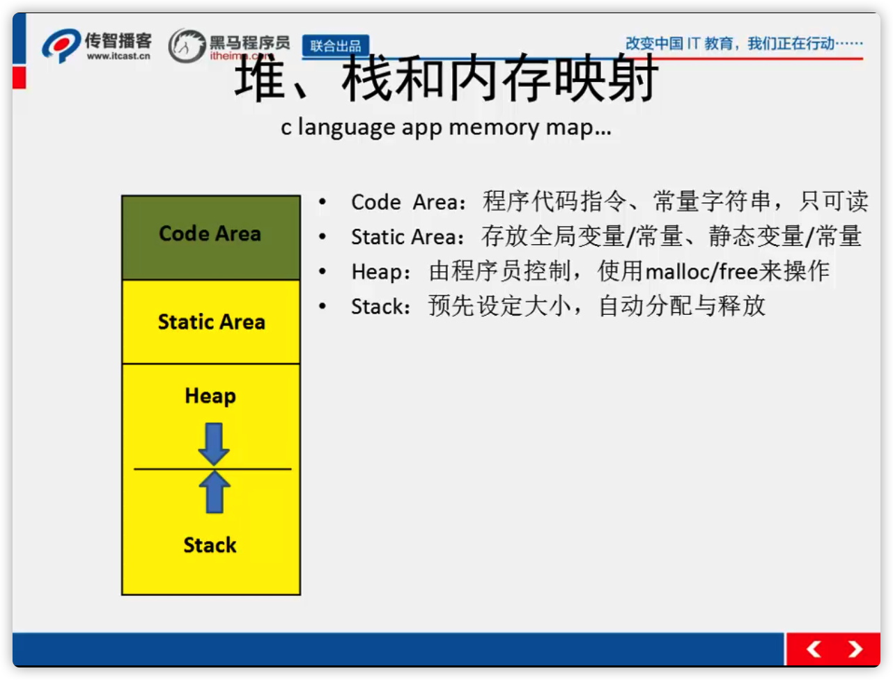

# 简介
c语言语法知识积累
## 数组
- 定义与初始化 类型说明符  数组名[`常量表达式`];
- 定义后知识开辟了一块内存空间（在栈中），还需要初始化
```C++
int i[5]={1,2,3,4,5};
int i[5]={1,2,3};  //其它元素的值会被默认设置为0
int i[]={1,2,3,4};
```
- 数组大小太大，或大小不能确定，则数组适合分配自`堆`里如：`int *arr = malloc(10000000 * sizeof(int));`是用完后记得释放内存，`free(arr)`。
## 二维数组
- 类型说明符 数组名[`常量表达式1`][`常量表达式2`]; 按行进行存放
- 赋值
```C++
int a[2][3] = {{1,2,3},{4,5,6}}; // 1、按行给二维数组赋初
int a[2][3] = {1,2,3,4,5,6}; // 2、将所有的数组元素按行顺序写在一个大括号内
int b[3][4] = {{1},{4,3},{2,1,2}}; // 3、对部分数组元素赋初值,对于没有赋值的元素，系统会自动赋值为0
```
## 函数
- 形参与实参
    - 定义时的参数叫形参，形式上存在，并不是真正的参数
    - 调用函数时传入的参数是实际参数，简称实参
- C语言中函数的定义是独立的，即一个函数不能定义在另一个函数内部
- 调用时函数的嵌套是有限制的，函数可以嵌套调用多少层是由程序运行时一个名为“栈”的数据结构决定的。一般而言，Windows上程序的默认栈大小大约为8 KB，每一次函数调用至少占用8个字节，因此粗略计算下，函数调用只能嵌套大约一千层，如果嵌套调用的函数里包含许多变量和参数，实际值要远远小于这个数目。
- 外部函数与内部函数
    - 在C语言中，可以被其他源文件调用的函数称为外部函数，在调用外部函数之前，`需要在当前源文件中定义外部函数`。定义外部函数的方式是在函数的返回值类型前面添加extern关键字。为简化编程，`C语言中允许在定义外部函数时省略关键字extern`。
    ```c++
    int add(int x,int y); // 这类格式的代码被称为函数原型
    // 1、程序员希望编译器自动从其他文件中查找该函数的定义
    // 2、程序员先定义未实现的空函数，然后在其他文件中具体实现
    ```
    - 一些特殊函数，这些函数只在它的定义文件中有效，该类函数称为内部函数; 需要在函数的返回值类型前面添加static关键字（又称为静态函数）;防止外部同名函数的干扰
## 指针
- 能用一级指针解决的问题不要二级，能用二级解决的不用三级，指针级数过多会导致程序很复杂
大量使用的是一级指针，二级指针也很常用，三级指针就很罕见了
- c语言想通过函数内部来修改实参的值，只能给函数传递实参的地址来间接的修改实参的值
- 当参数可能会改变地址时，需要使用到二级指针
- 指针变量之间赋值是需要兼容的
- void类型的指针可以做任意类型地址的赋值操作
- 指针运算的时候，不要在意指针具体指向一个什么样类型的地址，在意的是指针本身是什么样的类型
```c++
char *p = b;
p[0]是char类型
b[0]是什么char *类型
char **p = b;
p[0]是char *类型
```
## 内存管理
- {}内部定义的变量都是auto变量 
- 相同作用域不能有相同的变量
- 在代码块之外的变量是文件变量，也是全局变量；加了static的全局变量是只能在本文件访问到的全局变量
- extern 用来声明在别的文件已经实现的变量或者函数，告诉编译器，可以在其他文件中找到
- 静态区是程序加载到内存的时候就确定了，程序退出时从内存小时。`所有的全局变量和静态变量在程序运行期间都占用内存`。 
- 静态全局变量只能在定义它的文件内部访问，对于文件外部其他的文件是不可使用的
- 用malloc在堆中分配的空间不会自动释放，需要用free来手动释放，不free程序结束时才释放
- 一个程序的栈大小是有限的，如果一个数组特别大，会导致栈溢出，不要在栈里面定义太大的数组
- 如果使用一个特别大的数组，那么需要把数组放入堆，而不是栈
- 如果一个数组定义的时候，大小不能确定，那么就适合用堆，而不是用栈
- 如果malloc分配的内存忘记free，那么叫内存泄露，这个也是初学者最容易犯的错误
- malloc分配的空间的值是随机的，不会自动清0
### 堆、栈和内存映射

- 栈顶从`高地址向地地址方向增长`
- 函数的参数是`从右往左入栈`
### malloc calloc realloc
- `malloc`
    - `void *malloc(size_t size);`
    - 参数是指定分配的大小，单位-字节
    - malloc只负责分配，不负责初始化
- `calloc`
    - `void *calloc(size_t nmemb, size_t size);`
    - 第一个参数是指定单位的数量，第二个参数是指定一个单位的大小
    - calloc负责分配，并初始化为0
- `realloc`
    - `void *realloc(void *ptr, size_t size);`
    - 第一个参数是已经分配的内存地址，第二个参数是重新分配内存的大小，单位：字节
    - 分配的空间不会初始化为0
    - `如果有足够大的连续的空间，则在连续的空间上分配，不改变地址；如果没有足够大的空间，会在其他足够大的地方从头从新分配大小，并把之前的内容复制过来,释放之前的内存，会改变首地址。` 
- 当你想通过函数内部给`指针形参`分配内存的时候，形参一定要是一个`二级指针`。
- 操作系统（win8）每次给分配的堆变化是4k/次，4k就是内存最小页；优点是效率提升了，但浪费了一些内存。
## 结构体
- 一个结构体的成员，总是以最大成员为单位对齐。
    - 成员的声明顺序会影响对齐
    ```c++
    struct A
    {
        char a;
        short b;
        int c;
    }; // 8
    struct B
    {
        char a;
        short b; // a b之间闲置一个char。不同类型，总是在偶数位对齐
        char c;
        int d;
    }; // 12
    ```
    - 如果结构体成员出现数组，会以数组的而具体每个成员作为对齐标准
    - 如果结构体的所有成员都是一种类型，那么结构体变量在内存中就基本和一个数组类似，可以复制给同类型的数组，进行操作。（数据类型，就是数据在内存的分布表示）。
    ```c++
    struct D
    {
        char a[10];
        cahr b;
    }; // 大小为11，类似数组
    {
        struct D d = {0};
        char *s = (char*)&d; // 赋值给数组，当数组使用
    }
    ```
    - 位字段 `结构体变量 + : 位数`如 `char a : 2;`，用于同一数据结构，不同的数据结构分开用位字段
    ```c++
    struct E {
        char a : 2;
        int b : 2;
    };// 大小为8，而不是1
    ```
- `C语言要求结构体或联合至少有一个成员，而c++可以一个成员都没有`。
- `cpu处理int的效率是最高的，循环用int就用int`
- 结构体嵌套
    - 嵌套结构体按整体存在，即按对齐后的大小算。
- 结构体的赋值
    - `就是内存拷贝`
- `结构体的数组成员和指针成员`
    - 指针成员需要指向已初始化的内存，或者用malloc等内存分配函数去分配内存，不然使用是容易出现操控空指针，引发问题。
    - 存在浅拷贝，只拷贝了地址，共享了同一地址，可能出现别人释放了内存，导致共享的其他人再操控内存时，却发现数据已经被释放了。
    - `结构体在堆上或者里面的指针指向堆，需要先释放指针指向的资源，不然就内存泄露了`
    ```c++
    struct man{
        char *name;
        int age;
    };
    struct man *p1 = malloc(sizeof(struct man)); // 申请一个堆空间，但p1->name还是个野指针，没有指向一个分配好的内存空间
    p1->name = malloc(20); 
    p1->age = 20;
    // do something
    if (p1->name != NULL){ // 得先释放结构体中的内存
        free(p1->name);
        p1->name = NULL;
    }
    if (p1 != NULL) //再释放整体内存
    {
        free(p1);
        p1 = NULL;
    }
    ```
- 结构体做函数参数
    - 作为形参时，会有个`浅拷贝`的过程，因此需要注意浅拷贝的问题，还需要考虑拷贝带来的效率问题，`可以用结构体指针作为参数`。

- 所有函数外，不能进行运算，但可以声明的时候进行初始化。
## 枚举
- 是int常量
- 提高代码可读性
- 定义为全局变量，可以直接使用
## typedef
- 别名->有意义的名字，提高可读性 
- 别名->让名字独一无二，提高可维护性，当该类型需要修改时，只需要需改typedef定义的类型，而不用每个文件一个个修改，如`typedef short MYSHORT`当后来发现short大小不够用，可以改为`typedef int MYSHORT`。
## 文件操作
### fopen
- 函数原型`FILE *fopen (const char *path, const char * mode);`
    - path：文件路径，可以使相对地址，也可以是绝对地址
    - mode 打开的方式
        - r 只读，文件必须可读，文件必须存在
        - r+ 读写方式打开，文件必须存在
        - rb+ 以二进制形式读写，文件必须存在
        - rw+ 以文本形式读写文件
        - w 打开只写文件，文件存在写时清空。文件不存在则建立该文件
        - w+ 打开可读写文件，文件存在则清零。文件不存在则建立该文件
        - a 以附加方式只写，文件不会清空。文件不存在则建立该文件
        - a+ 以附加方式打开可读写的文件
- 成功打开文件，需要关闭文件`fclose(FILE*)`;
### getc 和 putc 函数
- `int getc(FILE *stream);` getc的返回值是一个char
    - 以字节为单位读取文件内容
    - 文本文件的最后结束标示是-1，也就是宏EOF
- `int putc (int c, FILE *stream);` putc，向文件写一个char
### fgets 和 fputs 函数
- `int fputs(const char *str, FILE *stream)`fputs一次写入一个字符串
- `char *fgets(char *str, int n, FILE *stream);`fgets读取一行，包括行号\n
### feof
- `int feof(FILE *streeam);`
- 如果已经是文件结尾，返回true
### fscanf 和 fprintf
- `int fscanf(FILE *stream, const char *format, ...)` 从流 stream 读取格式化输入
- `int fprintf(FILE *stream, const char *format, ...)` 发送格式化输出到流 stream 中