<!-- TOC -->

- [1. Java基础](#1-java基础)
    - [1.1. JVM](#11-jvm)
        - [1.1.1. 字节码](#111-字节码)
        - [1.1.2. 源码到执行](#112-源码到执行)
        - [1.1.3. JDK与JRE](#113-jdk与jre)
        - [1.1.4. Oracle JDK 和 OpenJDK 的对比](#114-oracle-jdk-和-openjdk-的对比)
        - [1.1.5. JAVA和C++的区别](#115-java和c的区别)
        - [1.1.6. import java 和 javax 有什么区别？](#116-import-java-和-javax-有什么区别)
    - [1.2. 基本的语法](#12-基本的语法)
        - [1.2.1. 基础类型及其存储空间大小](#121-基础类型及其存储空间大小)
            - [1.2.1.1. 自动装箱与拆箱](#1211-自动装箱与拆箱)
            - [1.2.1.2. 深入理解装箱与拆箱](#1212-深入理解装箱与拆箱)
        - [1.2.2. 关键字](#122-关键字)
        - [1.2.3. 流程控制语句](#123-流程控制语句)
        - [1.2.4. 泛型](#124-泛型)
            - [1.2.4.1. 泛型擦除](#1241-泛型擦除)
            - [1.2.4.2. 泛型类](#1242-泛型类)
            - [1.2.4.3. 泛型接口](#1243-泛型接口)
            - [1.2.4.4. 泛型方法](#1244-泛型方法)
            - [1.2.4.5. 常用的通配符为： T，E，K，V，？](#1245-常用的通配符为-tekv)
        - [1.2.5. ==和equals的区别](#125-和equals的区别)
        - [1.2.6. hashCode()与equals()](#126-hashcode与equals)
            - [1.2.6.1. hashCode()](#1261-hashcode)
            - [1.2.6.2. 重写 equals 时必须重写 hashCode](#1262-重写-equals-时必须重写-hashcode)
        - [1.2.7. 方法(函数)](#127-方法函数)
            - [1.2.7.1. java 程序设计语言总是采用按值调用](#1271-java-程序设计语言总是采用按值调用)
        - [1.2.8. 重载与重写](#128-重载与重写)
        - [1.2.9. 深拷贝与浅拷贝](#129-深拷贝与浅拷贝)
            - [1.2.9.1. 基本数据类型与引用数据类型](#1291-基本数据类型与引用数据类型)
        - [1.2.10. String](#1210-string)
            - [1.2.10.1. String StringBuffer 和 StringBuilder 的区别](#12101-string-stringbuffer-和-stringbuilder-的区别)
        - [1.2.11. 面向对象](#1211-面向对象)
            - [1.2.11.1. 构造器 Constructor](#12111-构造器-constructor)
            - [1.2.11.2. 成员变量与局部变量的区别](#12112-成员变量与局部变量的区别)
            - [1.2.11.3. 对象实例与对象引用](#12113-对象实例与对象引用)
            - [1.2.11.4. 继承](#12114-继承)
            - [1.2.11.5. 多态](#12115-多态)
            - [1.2.11.6. 接口和抽象类](#12116-接口和抽象类)
        - [1.2.12. 其他](#1212-其他)
            - [1.2.12.1. Java 序列化中如果有些字段不想进行序列化，怎么办？](#12121-java-序列化中如果有些字段不想进行序列化怎么办)
            - [1.2.12.2. 获取用键盘输入常用的两种方法](#12122-获取用键盘输入常用的两种方法)
    - [1.3. Java核心技术](#13-java核心技术)
        - [1.3.1. 集合Collections与数组](#131-集合collections与数组)
            - [1.3.1.1. 集合框架](#1311-集合框架)
            - [1.3.1.2. 集合与数组的区别](#1312-集合与数组的区别)
            - [1.3.1.3. 集合的方法](#1313-集合的方法)
            - [1.3.1.4. 常用集合的分类](#1314-常用集合的分类)
            - [1.3.1.5. list和set的区别](#1315-list和set的区别)
            - [1.3.1.6. List](#1316-list)
            - [1.3.1.7. Set](#1317-set)
            - [1.3.1.8. map](#1318-map)
            - [1.3.1.9. HashMap和HashTable的比较](#1319-hashmap和hashtable的比较)
            - [1.3.1.10. TreeMap](#13110-treemap)
            - [1.3.1.11. map的其他的类](#13111-map的其他的类)
        - [1.3.2. 异常](#132-异常)
            - [1.3.2.1. java异常类层次结构图](#1321-java异常类层次结构图)
            - [1.3.2.2. Throwable 类常用方法](#1322-throwable-类常用方法)
            - [1.3.2.3. try-catch-finally](#1323-try-catch-finally)
            - [1.3.2.4. 使用`try-with-resources`来代替`try-catch-finally`](#1324-使用try-with-resources来代替try-catch-finally)

<!-- /TOC -->
# 1. Java基础
## 1.1. JVM
Java 虚拟机（JVM）是运行 Java 字节码的虚拟机。JVM 有针对不同系统的特定实现（Windows，Linux，macOS），目的是使用相同的字节码，它们都会给出相同的结果。
### 1.1.1. 字节码
即扩展名为 `.class`的文件，它不面向任何特定的处理器，只面向虚拟机，**在一定程度上解决了传统解释型语言执行效率低的问题，同时又保留了解释型语言可移植的特点**。
### 1.1.2. 源码到执行
- `.java`文件(源代码)—>JDK中的`javac`的**编译**->`.class`文件(JVM可理解的Java字节)->JVM上变成可执行的**二进制机器码**。
- 我们需要格外注意的是 .class->机器码 这一步，这一步 JVM 类加载器首先加载字节码文件，**然后通过解释器逐行解释执行**，这种方式的执行速度会相对比较慢。
- Java 是编译与解释共存的语言。
### 1.1.3. JDK与JRE
- JDK 是 Java Development Kit，它是功能齐全的 Java SDK。**运行+开发**
- JRE 是 Java 运行时环境。**运行 不能开发**。
### 1.1.4. Oracle JDK 和 OpenJDK 的对比
- Oracle JDK 更稳定，并不完全开源，可以认为是OpenJDK的补丁版，大概6月一更新
- OpenJDK 是一个参考模型并且是完全开源的。
### 1.1.5. JAVA和C++的区别
- 都是面向对象的语言，都支持封装、继承和多态
- Java **不提供指针**来直接访问内存，程序内存更加安全
- Java 的类是**单继承**的，C++ 支持多重继承；虽然 Java 的类不可以多继承，但是**接口可以多继承**。
- Java 有**自动内存管理机制**，不需要程序员手动释放无用内存
- 在 C 语言中，字符串或字符数组最后都会有一个额外的字符‘\0’来表示结束。但是，Java 语言中没有结束符这一概念。
### 1.1.6. import java 和 javax 有什么区别？
以前javax是java的拓展，但渐渐的javax逐渐扩展为java API的一部分，现在java和javax没有区别，这都是一个名字。
## 1.2. 基本的语法
java的基础语法不少于c++的基础语法一样，这里重点标明不一样的地方。
### 1.2.1. 基础类型及其存储空间大小
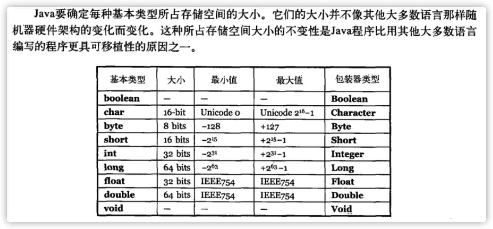
- **char在java中占2个字节**
- **boolean占一个位**
#### 1.2.1.1. 自动装箱与拆箱
- 装箱：将基本类型用它们对应的引用类型包装起来；int -> Integer `Integer i = 10;`
- 拆箱：将包装类型转换为基本数据类型；Integer -> int  `int n = i;`
所谓的自动装箱与拆箱，就是个自动类型转换的。
#### 1.2.1.2. 深入理解装箱与拆箱
- Byte,Short,Integer,Long包装类默认创建了数值[-128，127] 的相应类型的缓存数据，Character创建了数值在[0,127]范围的缓存数据，可以通过正常的加减乘除法和赋值，先在缓存区中找，超出了范围在创建新的对象，或者**new** 也会创建一个新的对象。
- Boolean 直接返回True Or False，也是缓存好的
- Byte,Short,Integer，Character自动装箱与拆箱调用valueOf
- Float Double没有缓存，因为浮点对于他们是无限的，不好提前缓存。
```java
// Integer 缓存源代码
public static Integer valueOf(int i) {
        if (i >= IntegerCache.low && i <= IntegerCache.high)
            return IntegerCache.cache[i + (-IntegerCache.low)];
        return new Integer(i);
    }
```
### 1.2.2. 关键字
- 基本与C++差不多
- abstract 用于抽象类和函数
- extends 用于继承
- final 不可变
- implements 实现（继承）接口
- interface 声明接口
- synchronized 用户类 或 类中函数的同步
- volatile 保证被修饰的变量的修改对其他线程是立即可见的。
- transient 决绝序列化(串行化),该对象的某个变量是transient，那么这个变量不会被串行化进去.
- import 与python和golang的import一样，导入包，类似于c++的include
- package 与golang的package类似，申明当前文件属于哪个包的。
> java的包名可以让编译器知道该文件在哪个位置，往往是项目相对路径，**编译它时需要在项目的根目录编译；进行反射时，类的名字是需要包含包名的**。
- null 空
- strictfp (不常用)可应用于类、接口或方法。使用 strictfp 关键字声明一个方法时，该方法中所有的float和double表达式都严格遵守FP-strict的限制,符合IEEE-754规范
### 1.2.3. 流程控制语句 
- if else while for break continue return 与c++一致，foreach语句与c++的有点不同。
### 1.2.4. 泛型
- Java 泛型（generics）提供了**编译时类型安全检测机制**，该机制允许程序员在编译时检测到非法的类型。
- 泛型的本质是**参数化类型**，也就是说所操作的数据类型被指定为一个参数。
- 使用的时候类似乎c++模板参数列表的使用`<>`.
- **泛型的类型参数只能是类类型，不能是简单类型.**
#### 1.2.4.1. 泛型擦除
- Java的泛型是伪泛型，这是因为Java在编译期间，所有的泛型信息都会被擦掉，这也就是通常所说类型擦除
#### 1.2.4.2. 泛型类
```java
public class Generic<T>
{
    private T key;
    public Generic(T key)
    {
        this.key = key
    }
    public T getKey()
    {
        return key;
    }
}
```
使用实例化泛型类：
`Generic<Integer> genericInteger = new Generic<Integer>(123456);`
- **定义的泛型类，就一定要传入泛型类型实参么？**
> 并不是这样，在使用泛型的时候如果传入泛型实参，则会根据传入的泛型实参做相应的限制，此时泛型才会起到本应起到的限制作用。如果不传入泛型类型实参的话，在泛型类中使用泛型的方法或成员变量定义的类型可以为任何的类型。
```java
Generic generic = new Generic("111111");
Generic generic1 = new Generic(4444);
Generic generic2 = new Generic(55.55);
Generic generic3 = new Generic(false);

Log.d("泛型测试","key is " + generic.getKey()); //泛型测试: key is 111111
Log.d("泛型测试","key is " + generic1.getKey()); // 泛型测试: key is 4444
Log.d("泛型测试","key is " + generic2.getKey()); // 泛型测试: key is 4444
Log.d("泛型测试","key is " + generic3.getKey()); // 泛型测试: key is false
```
#### 1.2.4.3. 泛型接口
```java
public interface Generator<T>
{
    public T method();
}
```
**实现泛型接口，不指定类型**：
```java
// 在声明类的时候，需将泛型的声明也一起加到类中, GeneratorImpl<T>的,<T>不可少
class GeneratorImpl<T> implements Generator<T>
{
    @override
    public T method()
    {
        return null;
    }
}
```
**实现泛型接口，指定类型** `class GeneratorImpl<T> implements Generator<String>` 或者 `class GeneratorImpl implements Generator<String>`
#### 1.2.4.4. 泛型方法
```java
public static <E> void printArray( E[] intputArray)
{
    for (E element : intputArray)
        System.out.printf("%s ", element);
}
```
使用
```java
// 创建不同类型数组： Integer, Double 和 Character
Integer[] intArray = { 1, 2, 3 };
String[] stringArray = { "Hello", "World" };
printArray( intArray  ); 
printArray( stringArray  );
```
#### 1.2.4.5. 常用的通配符为： T，E，K，V，？
- ？ 表示不确定的 java 类型
- T (type) 表示具体的一个java类型
- K V (key value) 分别代表java键值中的Key Value
- E (element) 代表Element
### 1.2.5. ==和equals的区别
- == : 它的作用是判断**两个对象的地址**是不是相等。即判断两个对象是不是同一个对象。(**基本数据类型==比较的是值，引用数据类型==比较的是内存地址**)
- equals() : 它的作用也是判断两个对象是否相等，它**不能用于比较基本数据类型的变量**。
- equals()方法存在于Object类中，而Object类是所有类的直接或间接父类。**在不重写的时候与==功能一样，重写之后用于自定义比较**。
### 1.2.6. hashCode()与equals()
#### 1.2.6.1. hashCode()
- 作用是获取哈希码，也称为散列码，返回一个int整数。
- hashCode() 定义在 JDK 的`Object`类中，意味着java中的任何类都含有这个函数。
- hashcode 方法是本地方法，也就是用 c 语言或 c++ 实现的，该方法通常用来将对象的**内存地址转换为整数之后返回**。
#### 1.2.6.2. 重写 equals 时必须重写 hashCode
- 要求：**如果两个对象相等，则 hashcode 一定也是相同的**。
- 因为equals和hashCode最开始都是通过判断地址来判断相同的，如果equals不再以地址作为相等的判断条件，那么hashCode也不能用地址来判断了。
- hash存在碰撞问题，因此存在两个对象hashCode值相同，但对象不一样。
### 1.2.7. 方法(函数)
#### 1.2.7.1. java 程序设计语言总是采用按值调用
- **方法得到的是所有参数值的一个拷贝，也就是说，方法不能修改传递给它的任何参数变量的内容**。
> 不管是传入值还是引用类型的数据，作为参数是，得到的都只是他们的副本，引用得到的是引用的副本，而这个引用的副本是可以像变量一样被改变的。
```java
public class Test {

	public static void main(String[] args) {
		// TODO Auto-generated method stub
		Student s1 = new Student("小张");
		Student s2 = new Student("小李");
		Test.swap(s1, s2); // x 小李 y 小张
		System.out.println("s1:" + s1.getName()); //s1 小张
		System.out.println("s2:" + s2.getName()); //s2 小李 
	}

    // 引用副本的交换，并不能改变什么
	public static void swap(Student x, Student y) {
		Student temp = x;
		x = y;
		y = temp;
		System.out.println("x:" + x.getName());
		System.out.println("y:" + y.getName());
	}
}
```
- **一个方法不能修改一个基本数据类型的参数（即数值型或布尔型）**。
- **一个方法可以改变一个对象参数的状态**。
- **一个方法不能让对象参数引用一个新的对象**。
- **java函数能改变的只有引用对象中的数据，不能改变引用自身和基本类型**
### 1.2.8. 重载与重写
- 重载就是同样的一个方法能够根据输入数据的不同，做出不同的处理
- 重写就是当子类继承自父类的相同方法，输入数据一样，但要做出有别于父类的响应时，你就要覆盖父类方
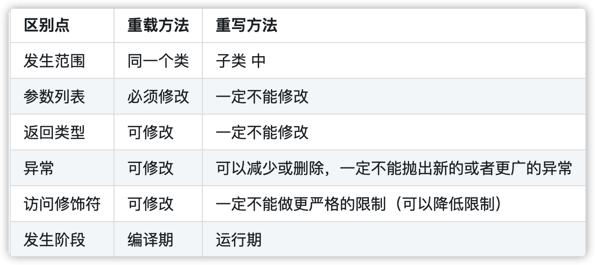
### 1.2.9. 深拷贝与浅拷贝
- 浅拷贝：对基本数据类型进行值传递，**对引用数据类型进行引用传递般的拷贝**，此为浅拷贝。
- 深拷贝：对基本数据类型进行值传递，**对引用数据类型，创建一个新的对象，并复制其内容**，此为深拷贝。
#### 1.2.9.1. 基本数据类型与引用数据类型
- 基本数据类型 byte，short，int，long，float，double，char，boolean
- 引用数据类型 数组，接口，类
### 1.2.10. String
- String对象是常量
- 当创建 String 类型的对象时，虚拟机会在**常量池**中查找有没有已经存在的值和要创建的值相同的对象，如果有就把它赋给当前引用。如果没有就在**常量池**中重新创建一个 String 对象。
#### 1.2.10.1. String StringBuffer 和 StringBuilder 的区别
- StringBuffer 对方法加了同步锁或者对调用的方法加了同步锁，所以是线程安全的。StringBuilder 并没有对方法进行加同步锁，所以是非线程安全的。
- StringBuffer 每次都会对 StringBuffer 对象本身进行操作，而不是生成新的对象并改变对象引用
- 巧记StringBuffer爸爸级别线程安全
### 1.2.11. 面向对象
#### 1.2.11.1. 构造器 Constructor
- Constructor 不能被 override（重写）,但是可以 overload（重载）,所以你可以看到一个类中有多个构造函数的情况，但父类的构造器不能被重写。
- **构造方法没有用`super()`来调用父类特定的构造方法，则会调用父类中“没有参数的构造方法”;如果父类没有无参构造函数，子类又不显式调用`super()`，则会编译出错。**
- **如果没有显式的构造函数，java会提供默认的无参构造函数；但是如果显式的了有参构造函数，java将不再提供默认的无参构造函数。**
#### 1.2.11.2. 成员变量与局部变量的区别
1. 从语法形式上看:成员变量是属于类的，而局部变量是在方法中定义的变量或是方法的参数；成员变量可以被`public,private,static`等修饰符所修饰，而局部变量不能被访问控制修饰符及`static`所修饰；但是，成员变量和局部变量都能被`final`所修饰.
2. 如果成员变量是使用static修饰的，那么这个成员变量是属于类的，如果没有使用static修饰，这个成员变量是属于实例的。而对象存在于堆内存，局部变量则存在于栈内存。
3. 成员变量如果没有被赋初值:则会自动以类型的默认值而赋值（一种情况例外:被 final 修饰的成员变量也必须显式地赋值），而**局部变量则不会自动赋值**。
#### 1.2.11.3. 对象实例与对象引用
1. 对象实例：通过new运算符实例化的对象，是在堆内存中；
2. 对象引用：指向对象实例，**存放在栈内存中**。
#### 1.2.11.4. 继承
- **子类拥有父类对象所有的属性和方法（包括私有属性和私有方法），但是父类中的私有属性和方法子类是无法访问，只是拥有。**
- 子类可以拥有自己属性和方法，即子类可以对父类进行扩展。
- 子类可以用自己的方式实现父类的方法。（重写）
#### 1.2.11.5. 多态
- **对象类型不可变，引用类型可变**；
- 方法具有多态性，属性不具有多态性；
- 多态不能调用“只在子类存在但在父类不存在”的方法；
- 如果子类重写了父类的方法，真正执行的是子类覆盖的方法，如果子类没有覆盖父类的方法，执行的是父类的方法。
#### 1.2.11.6. 接口和抽象类
- **接口的方法默认是 public**，所有方法在接口中不能有实现，而**抽象类可以有非抽象的方法**。
- 接口中除了 static、final 变量，不能有其他变量，而抽象类中则不一定。
- 一个类可以实现多个接口，但只能实现一个抽象类。**接口自己本身可以通过 extends 关键字扩展多个接口**。
- 从设计层面来说，抽象是对类的抽象，是一种模板设计，而接口是对行为的抽象，是一种行为的规范。
- 接口关键字 `interface` 抽象类关键字`abstract`.
> 备注：
- 在 JDK8 中，接口也可以定义静态方法，可以直接用接口名调用。实现类和实现是不可以调用的。如果同时实现两个接口，接口中定义了一样的默认方法，则必须重写，不然会报错。
- jdk9 的接口被允许定义私有方法 。
### 1.2.12. 其他
#### 1.2.12.1. Java 序列化中如果有些字段不想进行序列化，怎么办？
- 对于不想进行序列化的变量，使用 transient 关键字修饰。
- transient 关键字的作用是：阻止实例中那些用此关键字修饰的的变量序列化；**当对象被反序列化时，被 transient 修饰的变量值不会被持久化和恢复**。
- **transient 只能修饰变量，不能修饰类和方法**。
#### 1.2.12.2. 获取用键盘输入常用的两种方法
- 方法1：通过Scanner
```java
Scanner input = new Scanner(System.in);
String s = input.nextLine();
input.close();
```
- 方法二：通过BufferedReader
```java
BufferedReader input = new BufferedReader(new InputStreamReader(System.in));
String s = input.readLine();
```
## 1.3. Java核心技术
### 1.3.1. 集合Collections与数组
#### 1.3.1.1. 集合框架
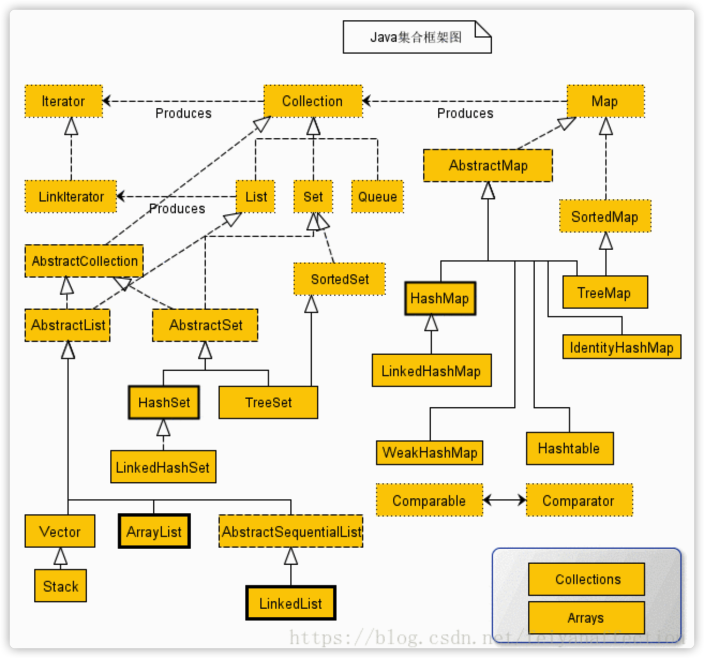
#### 1.3.1.2. 集合与数组的区别
1. 长度区别
- 数组固定长度
- 集合长度可变
2. 内容区别
- 数组可以是基本类型，也可以是引用类型
- 集合只能是引用类型
3. 元素内容
- 数组只能存储同种类型
- **集合可以存储不同的类型(其实集合一般存储的也是同一种类型)**
#### 1.3.1.3. 集合的方法
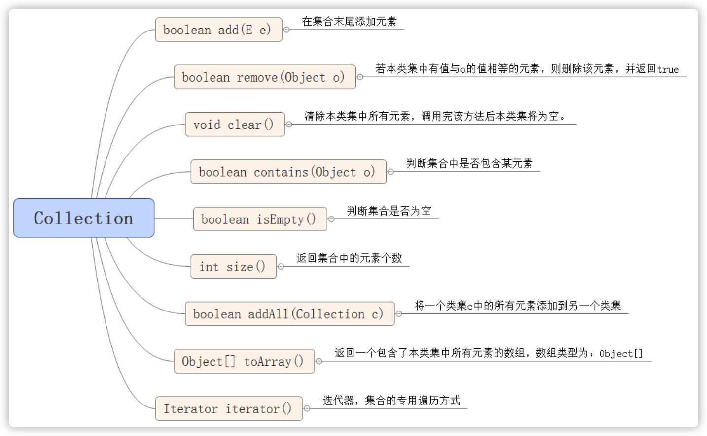
#### 1.3.1.4. 常用集合的分类
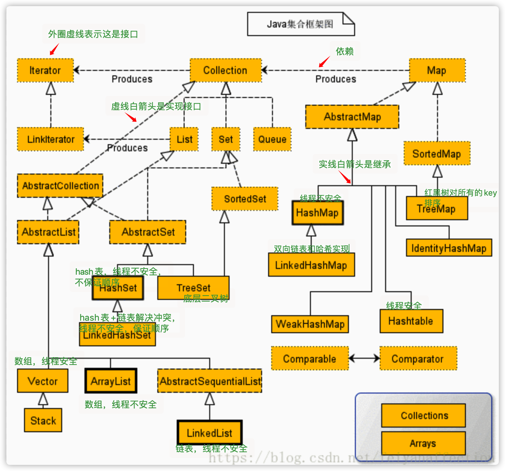
#### 1.3.1.5. list和set的区别
1. 有序性
- List保证按插入顺序排序
- Set存储和取出的顺序不一致
2. 唯一性
- List可以重复
- Set 元素唯一
3. 获取元素
- List可以通过索引操作元素
- Set不能根据索引获取元素
#### 1.3.1.6. List
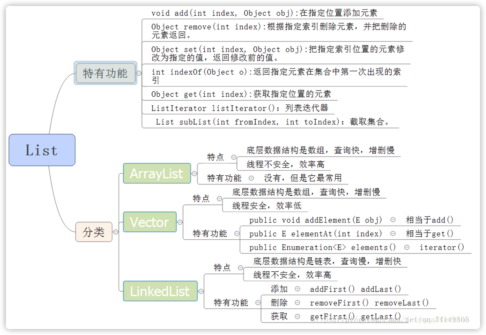
- 避免使用Vector，因为线程安全，但很低效
- ArrayList有三个构造方法
```java
public ArrayList(int initialCapacity)//构造一个具有指定初始容量的空列表。    
public ArrayList()      //默认构造一个初始容量为10的空列表。    
public ArrayList(Collection<? extends E> c)//构造一个包含指定 collection 的元素的列表
```
- Vector有四个构造方法
```java
public Vector()//使用指定的初始容量和等于0的容量增量构造一个空向量。    
public Vector(int initialCapacity)//构造一个空向量，使其内部数据数组的大小，其标准容量增量为零。    
public Vector(Collection<? extends E> c)//构造一个包含指定 collection 中的元素的向量    
public Vector(int initialCapacity,int capacityIncrement)//使用指定的初始容量和容量增量构造一个空的向量    
```
#### 1.3.1.7. Set
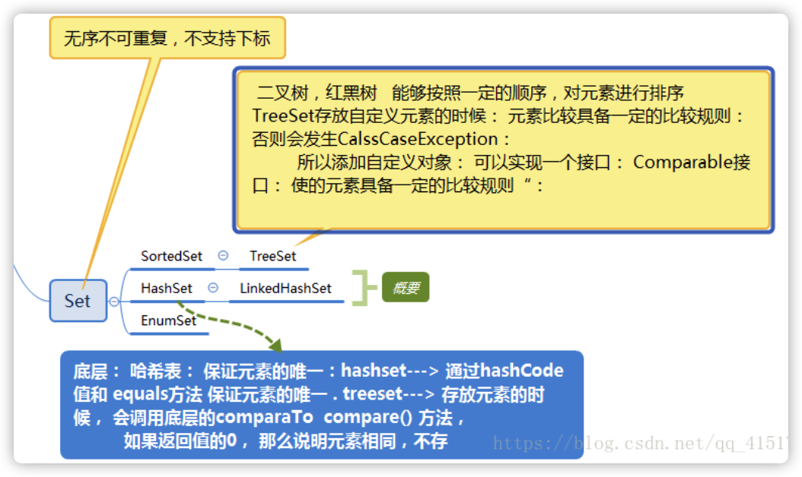
#### 1.3.1.8. map
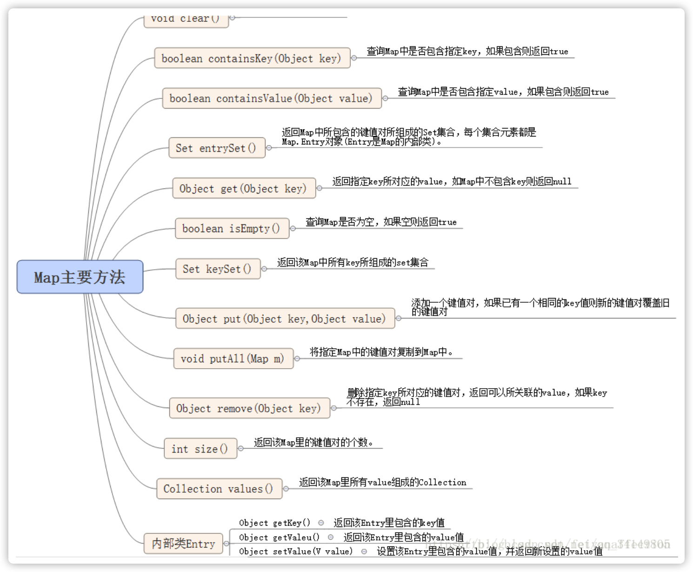
#### 1.3.1.9. HashMap和HashTable的比较
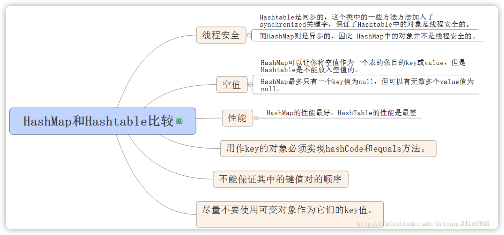
#### 1.3.1.10. TreeMap
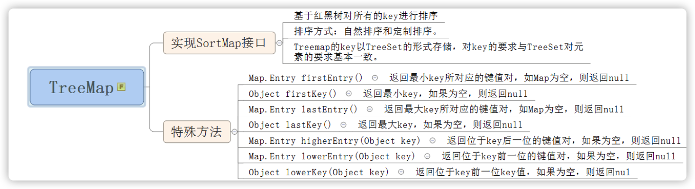
#### 1.3.1.11. map的其他的类
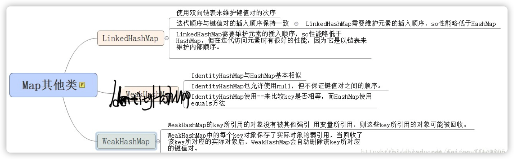
### 1.3.2. 异常
#### 1.3.2.1. java异常类层次结构图
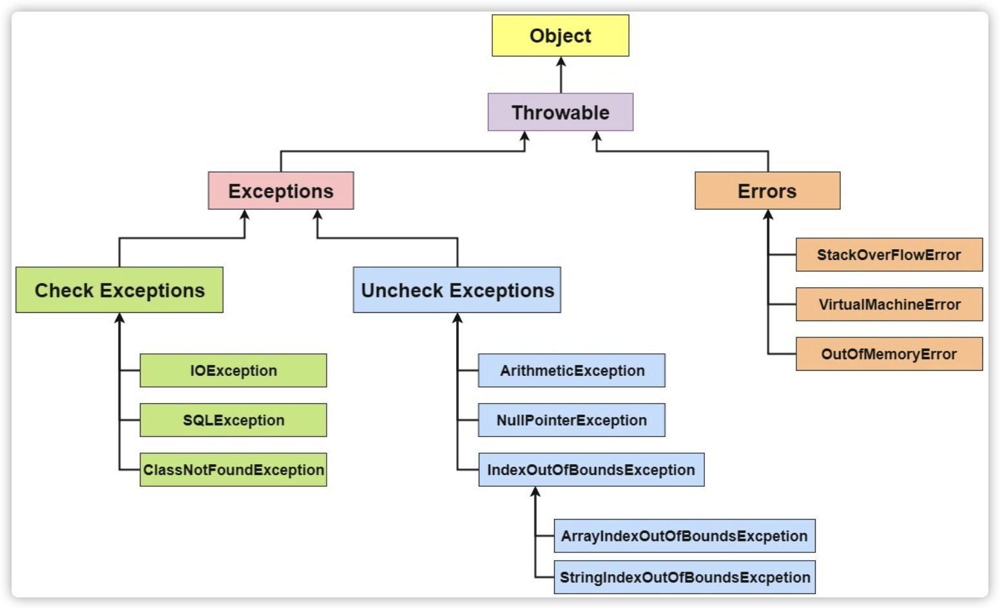
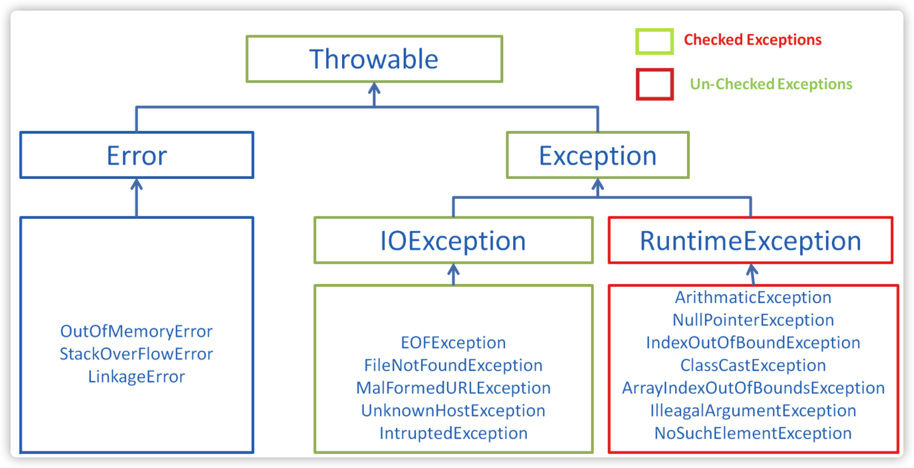
- Error（错误）:**是程序无法处理的错误**
> 大多数错误与代码编写者执行的操作无关，而表示代码运行时 JVM（Java 虚拟机）出现的问题。例如，Java 虚拟机运行错误（Virtual MachineError），当 JVM 不再有继续执行操作所需的内存资源时，将出现 OutOfMemoryError。**这些异常发生时，Java 虚拟机（JVM）一般会选择线程终止**。
- Exception（异常）:**是程序本身可以处理的异常**
> Exception 类有一个重要的子类 RuntimeException。RuntimeException 异常由 Java 虚拟机抛出。NullPointerException（要访问的变量没有引用任何对象时，抛出该异常）、ArithmeticException（算术运算异常，一个整数除以 0 时，抛出该异常）和 ArrayIndexOutOfBoundsException （下标越界异常）
#### 1.3.2.2. Throwable 类常用方法
- `public string getMessage()`:返回异常发生时的**简要描述**
- `public string toString()`:返回异常发生时的**详细信息**
- `public string getLocalizedMessage()`:返回异常对象的本地化信息。使用 `Throwable`的子类覆盖这个方法，可以生成本地化信息。如果子类没有覆盖该方法，则该方法返回的信息与`getMessage()`返回的结果相同.
- `public void printStackTrace()`:**在控制台上打印**`Throwable`对象封装的异常信息
#### 1.3.2.3. try-catch-finally
- `try`块:用于捕获异常。其后可接零个或多个`catch`块，**如果没有`catch`块，则必须跟一个`finally`块**
- `catch`块:用于处理 try 捕获到的异常。
- `finally`块:无论是否捕获或处理异常，finally 块里的语句都会被执行。当在 try 块或 catch 块中遇到 return 语句时，finally 语句块将在方法返回之前被执行。
> 以下4种特殊情况，finally块不会被执行:
1. 在finally语句块**第一行发生了异常。因为在其他行，finally块还是会得到执行**。
2. 在前面的代码中用了 System.exit(int)已退出程序。 exit 是带参函数 ；若该语句在异常语句之后，finally 会执行
3. 程序所在的线程死亡
4. 关闭 CPU
- 当`try`语句和`finally`语句中都有`return`语句时，在方法返回之前`finally`语句的内容将被执行，并且`finally`语句的返回值将会覆盖原始的返回值.
```java
public class Test 
{
    public static int f(int value)
    {
        try
        {
            return value * value;
        }
        finally
        {
            if (value == 2)
                return 0;
        }
    }
}
```
如果调用`f(2)`，返回值将是 0，因为`finally`语句的返回值覆盖了`try`语句块的返回值.
#### 1.3.2.4. 使用`try-with-resources`来代替`try-catch-finally`
> 面对必须要关闭的资源，我们总是应该优先使用`try-with-resources`而不是`try-finally`。随之产生的代码更简短，更清晰，产生的异常对我们也更有用。`try-with-resources`语句让我们更容易编写必须要关闭的资源的代码，若采用`try-finally`则几乎做不到这点。
- `try-finally`关闭资源的方式
```java
Scanner scanner = null; // 需要在try-finally先申明资源
try
{
    scanner = new Scanner(new File("/data/read.txt"));
    while (scanner.hasNext())
    {
        System.out.println(scanner.nextLine());
    }
}
catch (FileNotFoundException e)
{
    e.printStackTrace();
}
finally 
{
    if (scanner != null) 
        scanner.close();
}
```
- `try-with-resources`释放资源
``` java
try (Scanner scanner = new Scanner(new File("text.txt"))) //在这里申明资源
{
    while (scanner.hasNext())
    {
        System.out.println(scanner.nextLine());
    }
}
catch (FileNotFoundException e)
{
    e.printStackTrace();
}
```